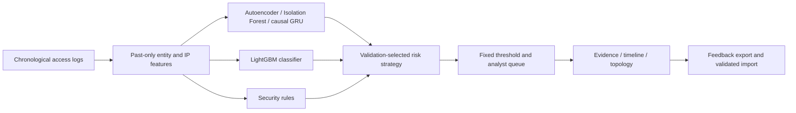

# SentinelUEBA — ML-Powered Network Access Analytics

**Harthik M V · Aspiring Machine Learning Engineer / Data Engineer**

A modified personal project connecting Computer Networks, machine learning and data engineering. Upload a packet capture, decode IPv4/IPv6 TCP/UDP headers, reconstruct bidirectional flows, inspect matching TCP handshakes, and score 13 flow features with a separately trained Isolation Forest. A second pipeline ingests network-access logs, computes behavioural risk scores and preserves analyst decisions. Both pipelines use FastAPI, React, isolated sessions and transactional SQLite storage.

**Live status:** the [GitHub Pages demo](https://harthik777.github.io/CN-Project/#packets) includes real browser-side PCAP analysis and the trained flow model. Render Free provides optional SQL persistence and access-log inference. The application can be cached or downloaded for offline presentations. Harthik's modifications include packet parsing, flow-model training and evaluation, inference serving, data validation, transactional storage, testing and deployment.

## ML and data engineering focus

| Area | What this project demonstrates |
|---|---|
| Machine learning engineering | Newly trained flow Isolation Forest, capture-disjoint synthetic evaluation, 13 flow features, saved UEBA model integration and versioned inference |
| Data engineering | Packet-to-flow transformation, capture SHA-256 lineage, queryable SQL flow tables, schema validation, chronological event replay and transactional audits |
| Deployment and verification | Docker, FastAPI, React/TypeScript, GitHub Actions, public HTTPS and measured local/cloud experiments |
| Computer Networks coursework | IP/TCP/UDP header parsing, bidirectional five-tuples, TCP sequence acknowledgements and handshake timing, packet/byte accounting, HTTP delivery experiments |

## Course and portfolio evidence

| Start here | Contents |
|---|---|
| [Current academic report](docs/ACADEMIC_REPORT.md) | Problem, CN objectives, architecture, implementation, evaluation and limitations |
| [Packet analysis lab](docs/PACKET_LAB.md) | PCAP parser, TCP/UDP flow pipeline, trained flow model, reproducibility and Wireshark demonstration |
| [Computer networks lab](docs/NETWORK_LAB.md) | HTTP batching, retry semantics, ordering, session isolation and repeatable commands |
| [Measured results](docs/RESULTS.md) | Local and Render experiments with raw JSON evidence |
| [Presentation and résumé pack](docs/PORTFOLIO.md) | ML Engineer and Data Engineer résumé variants, project pitch, demonstration and viva answers |

The live console exposes source-IP fan-out, failure ratio and activity windows. The lab replays identical inputs in different batch sizes, checks matching outputs and tests application delivery failures through real HTTP requests. It records client and server timings separately.

## Dependable demonstration

- Packet analysis computes a real local result first. Automatic mode additionally saves to SQL when the server is reachable; Browser only mode never uploads the capture.
- The browser and Python implementations are compared over 136 captures, including six real-traffic excerpts and malformed inputs, and 1,244 flows. Their scores agree within 1e-12 with matching alert decisions.
- A service worker caches the application shell after a successful visit. Download offline HTML for a presentation that does not depend on reaching either host.
- The latest packet report and live-event result are retained separately in this browser for up to seven days, with export and clear controls. These are browser copies, not replicated server storage.
- Access-log inference still requires Render; saved results remain read-only when disconnected, and the bundled Alerts replay is available.

Packet analysis defaults to **Browser only: no upload**. Download the [self-contained presentation HTML](https://github.com/Harthik777/CN-Project/releases/download/v4.1.1/SentinelUEBA-Offline.html) from the [v4.1.1 release](https://github.com/Harthik777/CN-Project/releases/tag/v4.1.1). See [failure behavior, reproduction and limits](docs/DEPENDABILITY.md) and the [public verification record](docs/PUBLIC_DEPLOYMENT.md).

## Try the demo

**[Open Packet analysis](https://harthik777.github.io/CN-Project/#packets)**, choose a **Bundled dataset**, and select **Analyze selected dataset**. Six recorded CTU excerpts contribute 1,200 packets and 194 flows. Source hashes, packet selection and payload redaction are documented in [REAL_DATA.md](docs/REAL_DATA.md). They are stored with the application and require no live dataset download.

The frozen synthetic-trained model flags 153 of 159 normal DNS flows in these excerpts, demonstrating poor transfer to this real traffic. The app exposes this limitation and does not claim real-data attack accuracy. Recorded data is now available for inspection; the model has not been retrained on it.

For the original handshake demonstration, choose **Synthetic teaching sample**: 378 packets, 32 flows and 22 matching TCP handshakes. Select flow 2 to inspect a handshake, compare UDP traffic, then export CSV/JSON. **Download selected PCAP** provides the same packet bytes for Wireshark. Uploads accept classic PCAP up to 512 KiB; PCAPNG must first be converted to pcap. The app performs offline capture analysis, not automatic capture of browser or server network traffic.

The **Live inference** view connects raw event submission, real model scoring, evidence inspection and server-side analyst feedback. See [backend setup and guarantees](docs/BACKEND.md). The original benchmark replay remains available in Alerts, Topology and Model audit.

**Public full-stack demo:** [Open SentinelUEBA on Render](https://sentinelueba-harthik.onrender.com/#live). The [GitHub Pages demo](https://harthik777.github.io/CN-Project/#packets) analyzes packet captures locally even when the Render API is unavailable. Hosting works independently of the developer's computer. Render Free can sleep when idle; demo sessions use temporary disk and can be lost on sleep, restart or redeployment. Export evidence before leaving. See the [deployment record](docs/PUBLIC_DEPLOYMENT.md).

Open [the self-contained console](assets/SentinelUEBA-React-Console.html) in a modern browser. It needs no installation or internet. Download the HTML before opening it if viewing this README on GitHub.

```powershell
Start-Process .\assets\SentinelUEBA-React-Console.html
```

The console opens with the coverage policy. Search by principal, behaviour, IP or resource; inspect an alert; compare policies; explore entity topology; open Model audit. [Three-minute demo script](docs/DEMO_SCRIPT.md).

## What the evidence shows

The separate flow model trains on 480 benign flows, selects a threshold using 192 validation flows, and evaluates on 256 flows from different synthetic captures. The fixed test produces 64 true positives, 13 false positives, 179 true negatives and 0 false negatives: 83.12% precision, 100% recall and 6.77% benign false-positive rate. This is a deliberately simple synthetic benchmark, not operational-traffic detection accuracy. The [packet lab](docs/PACKET_LAB.md) and [model manifest](artifacts/packet_flow/flow_model.json) document the features, capture hashes, limitations and reproduction commands. The packet HTTP harness independently compares header and flow statistics with dpkt.

### Retained access-log benchmark

The supplied chronological test contains **115,360 events and 2,300 attacks**. Recomputed from the supplied scored events:

| Fixed validation policy | Alerts | Precision | Attack recall | False positives |
|---|---:|---:|---:|---:|
| Top 1%: precision first | 1,074 | 100.0% | 46.7% | 0 |
| Top 2%: coverage | 3,097 | 73.7% | 99.3% | 813 |

PR-AUC is **0.9943** and attack-type macro-F1 is **0.9469** in the original synthetic evaluation. Named budgets describe validation thresholds; realised test alert rates are 0.93% and 2.68%. At top 1%, none of the 8 impossible-travel or 28 device-spoofing events are surfaced. Classification accuracy and alert recall answer different questions.

Five further seeds test variation within the same generator. They do not establish generalisation to new organisations or attack distributions. The SPEDIA probe uses a rule-severity proxy and does not validate real-world attack detection. The LANL harness is included but has no executed real-data result in this package.

## Architecture



The classifier-led strategy won the original validation comparison. Rules and anomaly channels offer additional evidence. The topology is a visualisation, not a graph detection model.

## Python setup and verification

Use Python 3.11+ in an isolated environment. Saved scikit-learn estimators were produced with 1.8.0; `requirements-dev.txt` pins that version for replay.

```powershell
python -m venv .venv
.\.venv\Scripts\python -m pip install -r requirements-api.txt
.\.venv\Scripts\python -m unittest discover -s tests -v
.\.venv\Scripts\python -m src.inference --input data/access_logs_sample.csv --output output/inference_replay.parquet --policy top_2pct
```

The bundled 25,000-event sample starts at the beginning of the log. It is a replay smoke test, not the held-out benchmark window. Do not report its alert counts as test performance.

To regenerate the full corpus, train models, or use Streamlit, install `requirements.txt` in the same environment and run:

```powershell
.\.venv\Scripts\python -m pip install -r requirements.txt
.\.venv\Scripts\python run_all.py --fresh
.\.venv\Scripts\python -m streamlit run dashboard/app.py
```

Training replaces generated model/data artifacts. The original report is preserved under `docs/original_submission/02_TECHNICAL_REPORT/`; a new training run requires fresh evaluation and provenance before updating claims.

## Frontend build

Use Node **22.12+**, preferably Node 24, including an npm installation running on that Node version.

```powershell
cd frontend
npm ci
npm run build
```

This checks TypeScript and publishes the offline HTML into `assets/`. `npm run dev` launches the development server. The source GitHub Actions workflow covers Python/API tests and the frontend build. The separate `codex/public-demo` branch is the GitHub Pages deployment artifact. All 41 tests and the frontend build also passed in a [fresh Linux GitHub Actions run](https://github.com/Harthik777/CN-Project/actions/runs/34265825462).

## Analyst feedback

1. Save a disposition in the console. The latest decision is stored in that browser, scoped to the score snapshot.
2. Select **Export decisions** to download `sentinel-feedback.json`.
3. Preview the import, then append validated records using the configured Python environment:

```powershell
python -m src.import_feedback path/to/sentinel-feedback.json
python -m src.import_feedback path/to/sentinel-feedback.json --apply
```

The importer checks the snapshot hash, event IDs, dispositions, and timestamps before writing. Re-importing the same decisions skips duplicates. Python retains previous decisions in a CSV audit trail and uses the latest decision per event for overrides. The CSV workflow assumes a single writer; it is not a tamper-proof or concurrent database.

Saving or importing feedback does not retrain a model. The existing pipeline learns only from rows in its training/fitting windows; feedback on held-out events does not automatically move them into training. A rolling training window and independently frozen evaluation set remain future work.

## Next milestones

The current course deliverable includes a public service, a reproducible networking lab and measured correctness/performance evidence. Extensions with the most research value are independent labelled telemetry evaluation and incremental state processing, compared against the existing replay reference. The [presentation pack](docs/PORTFOLIO.md) explains how to demonstrate and defend the implemented work; the [initial project review](docs/PROJECT_REVIEW.md) preserves the baseline assessment.

## Project ownership and acknowledgements
Retained-component notices are preserved in [THIRD_PARTY_NOTICES.md](docs/THIRD_PARTY_NOTICES.md); component-level details and development assistance are recorded in [PROVENANCE.md](docs/PROVENANCE.md).
