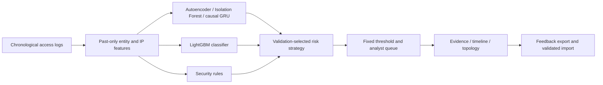

# SentinelUEBA

An explainable security analytics prototype that ranks suspicious access events for an analyst. It combines past-only entity/IP features, anomaly models, a LightGBM classifier, a React investigation console and a FastAPI live replay service with session isolation and a SQLite feedback audit.

**Status:** runnable academic/portfolio prototype using synthetic benchmark data. Included models and published metrics come from the supplied submission; the current workspace adds demo and feedback improvements. See [provenance](docs/PROVENANCE.md) and the [technical assessment](docs/PROJECT_REVIEW.md).

## Try the demo

The **Live inference** view connects raw event submission, real model scoring, evidence inspection and server-side analyst feedback. See [backend setup and guarantees](docs/BACKEND.md). The original benchmark replay remains available in Alerts, Topology and Model audit.

**Public full-stack demo:** [Open SentinelUEBA on Render](https://sentinelueba-harthik.onrender.com/#live). The [GitHub Pages frontend](https://harthik777.github.io/CN-Project/) connects to the same Render API. Hosting works independently of the developer's computer. Render Free can sleep when idle; demo sessions use temporary disk and can be lost on sleep, restart or redeployment. Export evidence before leaving. See the [deployment record](docs/PUBLIC_DEPLOYMENT.md).

Open [the self-contained console](assets/SentinelUEBA-React-Console.html) in a modern browser. It needs no installation or internet. Download the HTML before opening it if viewing this README on GitHub.

```powershell
Start-Process .\assets\SentinelUEBA-React-Console.html
```

The console opens with the coverage policy. Search by principal, behaviour, IP or resource; inspect an alert; compare policies; explore entity topology; open Model audit. [Three-minute demo script](docs/DEMO_SCRIPT.md).

## What the evidence shows

The supplied chronological test contains **115,360 events and 2,300 attacks**. Recomputed from the supplied scored events:

| Fixed validation policy | Alerts | Precision | Attack recall | False positives |
|---|---:|---:|---:|---:|
| Top 1%: precision first | 1,074 | 100.0% | 46.7% | 0 |
| Top 2%: coverage | 3,097 | 73.7% | 99.3% | 813 |

PR-AUC is **0.9943** and attack-type macro-F1 is **0.9469** in the original synthetic evaluation. Named budgets describe validation thresholds; realised test alert rates are 0.93% and 2.68%. At top 1%, none of the 8 impossible-travel or 28 device-spoofing events are surfaced. Classification accuracy and alert recall answer different questions.

Five further seeds test variation within the same generator. They do not establish generalisation to new organisations or attack distributions. The SPEDIA probe uses a rule-severity proxy and does not validate real-world attack detection. The LANL harness is included but has no executed real-data result in this package.

## Architecture



The classifier-led strategy won the original validation comparison. Rules and anomaly channels offer additional evidence. The topology is a visualisation, not a graph detection model.

## Python setup and verification

Use Python 3.11+ in an isolated environment. Saved scikit-learn estimators were produced with 1.8.0; `requirements-dev.txt` pins that version for replay.

```powershell
python -m venv .venv
.\.venv\Scripts\python -m pip install -r requirements-api.txt
.\.venv\Scripts\python -m unittest discover -s tests -v
.\.venv\Scripts\python -m src.inference --input data/access_logs_sample.csv --output output/inference_replay.parquet --policy top_2pct
```

The bundled 25,000-event sample starts at the beginning of the log. It is a replay smoke test, not the held-out benchmark window. Do not report its alert counts as test performance.

To regenerate the full corpus, train models, or use Streamlit, install `requirements.txt` in the same environment and run:

```powershell
.\.venv\Scripts\python -m pip install -r requirements.txt
.\.venv\Scripts\python run_all.py --fresh
.\.venv\Scripts\python -m streamlit run dashboard/app.py
```

Training replaces generated model/data artifacts. The original report is preserved under `docs/original_submission/02_TECHNICAL_REPORT/`; a new training run requires fresh evaluation and provenance before updating claims.

## Frontend build

Use Node **22.12+**, preferably Node 24, including an npm installation running on that Node version.

```powershell
cd frontend
npm ci
npm run build
```

This checks TypeScript and publishes the offline HTML into `assets/`. `npm run dev` launches the development server. The source GitHub Actions workflow covers Python/API tests and the frontend build. The separate `codex/public-demo` branch is the GitHub Pages deployment artifact. All 41 tests and the frontend build also passed in a [fresh Linux GitHub Actions run](https://github.com/Harthik777/CN-Project/actions/runs/34265825462).

## Analyst feedback

1. Save a disposition in the console. The latest decision is stored in that browser, scoped to the score snapshot.
2. Select **Export decisions** to download `sentinel-feedback.json`.
3. Preview the import, then append validated records using the configured Python environment:

```powershell
python -m src.import_feedback path/to/sentinel-feedback.json
python -m src.import_feedback path/to/sentinel-feedback.json --apply
```

The importer checks the snapshot hash, event IDs, dispositions, and timestamps before writing. Re-importing the same decisions skips duplicates. Python retains previous decisions in a CSV audit trail and uses the latest decision per event for overrides. The CSV workflow assumes a single writer; it is not a tamper-proof or concurrent database.

Saving or importing feedback does not retrain a model. The existing pipeline learns only from rows in its training/fitting windows; feedback on held-out events does not automatically move them into training. A rolling training window and independently frozen evaluation set remain future work.

## Next milestones

The [project review](docs/PROJECT_REVIEW.md) defines the highest-value additions for an internship portfolio: real telemetry replay with persistent state, independent generalisation experiments, and incident-level evaluation. The [demo script](docs/DEMO_SCRIPT.md) explains what to show and how to discuss current results accurately.

Original code and submission attribution: **Induj Gupta**, MIT license. See [LICENSE](LICENSE). Document personal contributions accurately when presenting this project.
