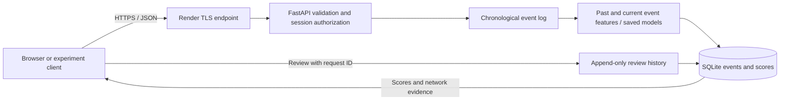
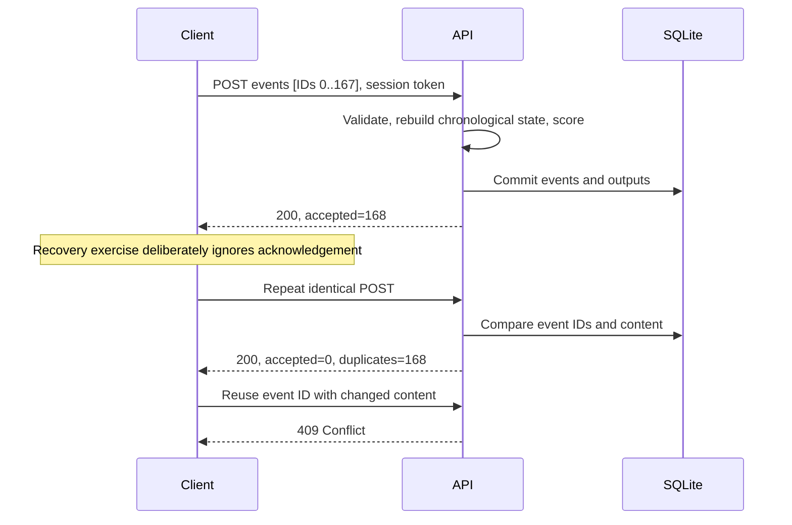

# Computer networks laboratory

**Question:** How do HTTP batching and application delivery rules affect an explainable network-access monitoring service?

This lab sends the project's synthetic access logs over actual HTTP(S) connections to the running inference API. It measures client request time and server work, and checks delivery correctness. The networking experiment is distinct from the original model benchmark. No traffic is sent to the IP addresses inside the synthetic events.

## Course concepts demonstrated

| CN concept | Implementation | Evidence to show |
|---|---|---|
| Client/server and application protocols | JSON requests, HTTP methods/status codes, a browser and Python client | `/docs`, request records in the experiment JSON |
| Transport and message boundaries | HTTP/1.1 over TCP; batches define application records | Compare 42, 84 and 168 events per POST |
| Reliable application delivery | Event IDs plus content comparison, transactional writes, review request IDs | Acknowledgement ignored then retried, duplicates skipped, conflicts rejected |
| Ordering and state | UTC event ordering and chronological replay after each append | Same events produce matching outputs across batch boundaries; late events rejected |
| Network security | Public HTTPS, certificate verification, session bearer capabilities | HTTPS target, missing-token and cross-session HTTP 401 checks |
| Network behaviour analysis | Per-IP account fan-out, failure ratio and activity windows | Campaign event 167: shared source, twelve accounts, repeated failures |
| Performance trade-offs | Sequential batches reduce request count but repeat prefix inference | Client and server timer comparison, fixed input hash, repeated trials |

The access-event `source_ip`, `protocol`, geography and device fields are supplied telemetry. They are not inferred from the submitting browser's socket. The current lab does not implement routing, congestion control, passive packet capture or a new transport protocol.

## Architecture and protocol





TCP delivers an ordered byte stream within a connection; it does not decide whether an application transaction committed before a client retries. Our POST requests gain duplicate protection from stored IDs and content checks. POST itself does not guarantee idempotency. Session creation is **not** idempotent. See [RFC 9110, idempotent methods](https://www.rfc-editor.org/rfc/rfc9110.html#section-9.2.2) and [RFC 9293, TCP service](https://www.rfc-editor.org/rfc/rfc9293.html#section-2.2).

## Reproduce locally, at no hosting cost

Install the dependencies and start the API using [BACKEND.md](BACKEND.md). Run the following in a second terminal from the project root:

```powershell
python scripts/network_lab.py --url http://127.0.0.1:7860 --output output/network-local.json
```

The command defaults to three repetitions of each batch size: 42, 84 and 168. Each trial starts with an empty isolated session and replays the same 168 events. Batch order rotates between repetitions. One preliminary full replay warms the service and supplies the comparison outputs. A reusable HTTP/1.1 client submits one request at a time. There are no automatic retries or parallel load generators. A failing observation makes the command exit nonzero and preserves partial evidence.

For the deployed service:

```powershell
python scripts/network_lab.py --url https://sentinelueba-harthik.onrender.com --output output/network-render.json
```

A full run creates 11 short-lived sessions and makes 42 POST requests with the defaults. This stays below configured request-window limits when run alone, but other visitors share the instance. A 429 response means the run did not complete; wait before starting a new experiment. Free hosting may need time to wake. The experiment bounds batch sizes and repetitions to keep its load modest.

For a quicker correctness check:

```powershell
python scripts/network_lab.py --url http://127.0.0.1:7860 --repetitions 1 --batch-sizes 42 168 --output output/network-quick.json
```

GitHub Actions runs that shorter experiment against a real local HTTP socket after the Python tests, and uploads the resulting JSON/Markdown and server log as `network-lab-evidence`.

## Measurement definitions

| Measurement | Meaning | Interpretation limit |
|---|---|---|
| `client_ingest_ms` | Sum of wall-clock durations of the ingestion HTTP requests, including reading response bodies | Includes service work, transfer, connection establishment if needed, proxy and scheduling delays |
| `server_work_ms` | Sum of API `scoring_ms` values | Includes feature/model work and insert calls; excludes the final transaction commit and some request handling |
| Request/response body bytes | Serialized JSON payload bytes as sent/read by this client | Excludes HTTP headers, TLS records and TCP/IP framing |
| Median, min, max | Descriptive statistics across equal-work trials | Three observations do not establish p95, capacity or an SLA |
| Output comparison | IDs, labels and flags exact; seven numeric channels within absolute/relative tolerance `1e-6` | Specific fixture and saved model version, not a proof for all inputs |

**Do not call client time minus server time “network RTT.”** It also contains serialization, commits, proxy processing and other overhead. Likewise, dividing 168 by the time is a bounded replay completion rate, not maximum streaming throughput. DNS/TCP/TLS phases are not separately instrumented.

Every append recomputes the session prefix. For 168 events, batches of 42 process prefixes of 42, 84, 126 and 168 (420 total event evaluations); batches of 84 process 84 and 168 (252); a batch of 168 processes 168. Consequently, changes in completion time combine request-count effects with different amounts of model work. Larger batches also delay intermediate results. The experiment measures this service design, not TCP efficiency in isolation.

## Published observations

See [RESULTS.md](RESULTS.md) for the measured local and Render runs, raw evidence links, input/model identities and interpretation. Reports include client runtime, harness SHA-256, checkout revision, ordered request measurements and start/end timestamps. Tokens and raw session credentials are excluded.

The delivery exercise checks ignored acknowledgements, identical retries, conflicting event IDs, late events, reversed batches, validation without partial writes, missing credentials, session isolation, feedback retries, conflicting feedback keys and revision history. The acknowledgement exercise happens at the application level; no packet loss or TCP reset is injected. The separate real-model regression test reconstructs the store from SQLite between batches. Cloud disk durability across container replacement is not claimed.

## Optional packet inspection for a viva

If a rubric requires packet inspection, run the local HTTP experiment while capturing your own loopback interface in Wireshark. Filter with `tcp.port == 7860`, follow one TCP stream, and identify the request line, JSON body, response status and TCP acknowledgements. Keep captures local: request headers contain the temporary session token. Windows loopback capture may require the Npcap loopback interface. This is an optional extension; no packet capture is included in the published results. See [Wireshark User's Guide](https://www.wireshark.org/docs/wsug_html_chunked/ChapterIntroduction.html).

## Free deployment limits

The current public service uses Render Free with no paid volume or database. The free instance can sleep after inactivity, and local files are ephemeral. Export a session before leaving; maintain the local demo as a presentation fallback. See [Render's free-service documentation](https://render.com/docs/free) and the project's [deployment record](PUBLIC_DEPLOYMENT.md). HTTPS protects the client-to-public-endpoint connection; access to a particular session additionally requires its bearer capability. CORS is a browser access policy, not authentication.
