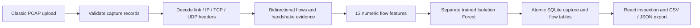

# Packet-to-flow network analytics

The packet lab also runs entirely in your browser when the server is unavailable. Use the [primary Pages demo](https://harthik777.github.io/CN-Project/#packets), or download its offline HTML. [Resilience design and verification](DEPENDABILITY.md).

Owner: **Harthik M V**. This extension adds packet-level Computer Networks work and a separate ML/data pipeline to SentinelUEBA.

Public entry: [Packet analysis](https://sentinelueba-harthik.onrender.com/#packets). Select **Analyze sample capture**, inspect a flow, then export JSON or CSV. A sample download lets an examiner inspect the exact same packet bytes in Wireshark. The sample is constructed traffic using documentation-only addresses; it is not a live network recording.

## Architecture



The access-log UEBA pipeline remains available under Live inference. Its four pretrained components expect user identities, authentication results and other access-log fields, so packet headers are not coerced into that schema. The flow model is newly trained by the included script and has its own manifest, evaluation, threshold and source identity.

## CN implementation

- **Link and network layers:** Ethernet, up to two 802.1Q/802.1ad VLAN tags, raw IP and Linux cooked v1. IPv4 header lengths and total lengths are validated. IPv6 processing supports bounded Hop-by-Hop, Routing, Destination Options and AH header traversal before TCP/UDP. TTL/hop limit is retained as evidence.
- **Transport layer:** source/destination ports, TCP flags, sequence and acknowledgement numbers, IP lengths and transport payload lengths are extracted. The parser checks TCP data offset and UDP length boundaries. No application protocol is inferred from port number alone.
- **Flow aggregation:** opposite directions share a five-tuple. A gap greater than 60 seconds or a new initial SYN sequence from the same endpoint starts a new flow. Forward always means the first observed sender, which need not be the original initiator in a partial capture.
- **Handshake evidence:** SYN, opposite-direction SYN-ACK and final ACK must have matching sequence acknowledgements, including 32-bit wraparound. SYN-to-SYN-ACK and completion timings are observed capture intervals, not a general RTT benchmark. TCP options, Fast Open and simultaneous-open handshakes are not fully modeled.
- **Repeated sequence ranges:** identical direction/sequence/payload-length tuples are counted as repeated ranges. These can be retransmissions, capture duplication or sequence reuse. They are not proof of packet loss.
- **Accounting:** every capture record is either parsed or appears in a skipped-reason count. Unsupported protocols, fragments and incomplete packet headers/payloads are excluded from flow statistics. No IP fragment or TCP stream reassembly is performed. Checksums are not validated by the runtime parser because capture offload can affect them.

Classic PCAP 2.4 supports both byte orders and microsecond/nanosecond records. Timestamps are converted to floating-point seconds for aggregation, so nanosecond input does not imply nanosecond measurement accuracy. Records are sorted by timestamp with original packet numbers retained. Original-record byte counts come from the capture metadata and are not an independently measured wire rate. IP-byte counts exclude link headers and padding.

**Bounds:** 512 KiB, 6,000 packet records, 250 flows, at most 12 preview headers per flow. All supported packets contribute to the statistics. PCAPNG, Linux cooked v2, loopback-specific link headers, ESP, IPv6 jumbograms and fragment reassembly are outside this version's support. In Wireshark, use Save As and select **pcap**, then choose a supported capture interface/link format and a short interval.

## Data engineering and API

1. `GET /api/packets/sample` downloads the bundled PCAP; `GET /api/packets/model` exposes its manifest and model metadata.
2. `POST /api/sessions` creates a capability-token session. Use the returned token in an Authorization Bearer header.
3. `POST /api/sessions/{id}/capture` accepts the raw file as `application/vnd.tcpdump.pcap` (a binary request body, not multipart form data).
4. `GET /api/sessions/{id}/capture` reads the persisted report. The UI reads this endpoint after upload, rather than displaying an optimistic local result.

The `captures` table stores a file SHA-256, model/extractor identity and summary. `capture_flows` stores typed, queryable endpoints, protocol, packet/byte counts, duration, scores and bounded header evidence. A transaction commits both tables together. Repeating the same capture/model pair is idempotent; a conflicting capture or model returns HTTP 409 and requires a new session. Rejected captures leave no partial records. The global lock serializes analysis with the original model service and limits simultaneous model memory use. This design is for a small public demo, not a throughput claim.

Original capture bytes and application payloads are never written to the database. Header-derived IPs and ports are present in reports, so upload only captures you are authorized to share. No server-side sniffing or active scanning takes place. The app can analyze uploaded real captures, but its trained model has only a synthetic evaluation. Render Free uses temporary disk; sessions expire after 24 hours and may disappear sooner on restart/redeployment. Export evidence for a submission.

## Flow model and reproducible evaluation

`scripts/train_flow_model.py` constructs valid packet frames entirely in memory. It never transmits traffic. IPv4/IPv6 TCP and UDP conversations form the benign baseline. Separate test captures include staged SYN probes, UDP bursts, large one-direction transfers and repeated TCP sequence ranges. These patterns are unusual for this generator; they are not verified real-world attacks.

| Split | Captures | Flows | Purpose |
|---|---:|---:|---|
| Train | 20 | 480 benign | Fit Isolation Forest, 100 trees, random state 77 |
| Validation | 8 | 192 benign | Select the 95th-percentile outlier-score threshold |
| Test | 8 | 192 benign + 64 staged unusual | Evaluate once at the frozen validation threshold |
| Public sample | 1 separate seed | 24 benign + 8 staged unusual | Demonstration only |

Capture seeds and SHA-256 hashes are disjoint across splits and recorded in [the model manifest](../artifacts/packet_flow/flow_model.json). IP addresses, ports, timestamps, capture IDs and scenario labels are excluded from the feature matrix. All splits use the same generator family, so this is not independent operational-traffic validation. Flow statistics summarize the capture offline; they are not causal packet-by-packet features.

The 13 features are log duration, log packet count, log IP bytes, log payload bytes, mean IP-packet size, reverse packet fraction, reverse byte fraction, log mean inter-arrival, inter-arrival coefficient of variation, SYN fraction, RST fraction, repeated-payload-range fraction and UDP indicator. Scores are negative Isolation Forest `score_samples`; a score strictly above the frozen threshold is flagged. Scores are not probabilities. Header observations are displayed as evidence, not as model feature attributions.

| Fixed synthetic test result | Value |
|---|---:|
| True positives / false positives | 64 / 13 |
| True negatives / false negatives | 179 / 0 |
| Precision / recall | 83.12% / 100.00% |
| F1 | 0.9078 |
| Average precision | 0.9894 |
| Benign false-positive rate | 6.77% |

The intentionally simple synthetic scenarios explain the high recall. Do not present this as production attack-detection performance or as evidence of generalization to real captures.

Reproduce from the repository root with Python 3.11 and `requirements-api.txt`:

```powershell
python scripts/train_flow_model.py --output output/reproduced-packet-model
python -m unittest discover -s tests -v
python -m pip install dpkt==1.9.8
python scripts/packet_lab.py --url http://127.0.0.1:7860 --output output/packet-local.json
python scripts/packet_lab.py --url https://sentinelueba-harthik.onrender.com --output output/packet-render.json
```

Train into an output directory for review before replacing the packaged artifact. The server verifies the artifact hash, extractor hash and feature schema at startup. Tests regenerate all eight test captures and reproduce the published confusion matrix without refitting the model. The HTTP lab uses **dpkt 1.9.8** as an independent decoder to compare packet/header counts, lengths, flow groupings and payload-length totals against the server, then checks authentication, idempotency, conflict handling, rejection atomicity and saved-result stability. Its 15 checks are correctness checks, not detection-accuracy tests. CI runs both the access-log HTTP experiment and packet HTTP experiment.

## Three-minute CN demonstration

1. Open Packet analysis and analyze the bundled sample: **378 packets, 32 flows and 22 matching TCP handshakes**.
2. Select a completed TCP flow (for example flow 2). Identify its source/destination ports and SYN, SYN-ACK and ACK packet numbers. Explain why acknowledgement values matter.
3. Select a UDP flow and explain the absence of a TCP-style handshake. Compare packet counts, timing and directionality for ordinary and burst flows.
4. Inspect a flagged flow, expand its 13 features and state that the score measures deviation from a synthetic baseline. A flagged flow is a review candidate.
5. Refresh the saved report, export CSV/JSON, and compare the downloaded sample in Wireshark. Point to the capture hash and model identity for reproducibility.

## References

- [Wireshark capture-file support](https://www.wireshark.org/docs/wsug_html_chunked/ChIOOpenSection.html)
- [TCP specification, RFC 9293](https://www.rfc-editor.org/rfc/rfc9293.html)
- [UDP header and length, RFC 768](https://www.rfc-editor.org/rfc/rfc768.html)
- [IPv4 specification, RFC 791](https://www.rfc-editor.org/rfc/rfc791.html)
- [IPv6 specification, RFC 8200](https://www.rfc-editor.org/rfc/rfc8200.html)
- [scikit-learn outlier/novelty detection](https://scikit-learn.org/stable/modules/outlier_detection.html)
